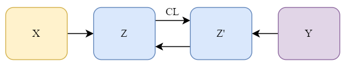

## Table of Contents
- [Table of Contents](#table-of-contents)
- [Contrastive Loss is the Final Piece in Generation](#contrastive-loss-is-the-final-piece-in-generation)
  - [Mutual Information](#mutual-information)
    - [Unifying Sequential Training](#unifying-sequential-training)
  - [InfoNCE Loss](#infonce-loss)
  - [Connecting with the EM-based Generation Framework](#connecting-with-the-em-based-generation-framework)
  - [Towards General Generation Framework](#towards-general-generation-framework)
  - [Towards Unified Framework for AI](#towards-unified-framework-for-ai)
  - [Cite this blog](#cite-this-blog)

## Contrastive Loss is the Final Piece in Generation
`Contrastive Learning`, or the famous `InfoNCE` loss is originally proposed in [this paper](https://arxiv.org/abs/1807.03748) as a general methodology, focusing on maximizing `Mutual Information`. In this blog, I connect `Contrastive Learning` with the `EM` generation framework. I will make an anology to the latest `diffusion` models. and further dicuss the possibility of a unified framework for Artificial Intelligence. 

### Mutual Information
By definition:

$$I(x; c) = \sum_{x,\ c}p(x, c)\log \frac{p(x, c)}{p(x)p(c)} = \sum_{x,\ c}p(x, c)\log \frac{p(x|c)}{p(x)}$$

Suppose that $x$ and $c$ are independent, $p(x, c) = p(x)p(c)$, giving $I = 0$. Not strictly speaking, suppose that there is a one-one mapping $x\overset{f}{\longleftrightarrow} y$, we have $p(x, c) = p(x) = p(c)$, giving $\max I = H(x)$.

#### Unifying Sequential Training
Contrastive Predictive Coding resonates with the `AR` training objective of language models. `Predicting the future` essentially learns the dependencies along a defined `sequence`, or `direction`. To encourage `long term dependencies`, or `slow features` in the paper, an objective that explicitly encourages maximum mutual information preservation is devised. 

### InfoNCE Loss
$$\mathcal{L}_N = -\mathbb{E}_X\left[\log\frac{f_k(x_{t+k}, c_t)}{\sum_{x_j\in X}f_k(x_j, c_t)}\right]$$

We would like to enhance the mutual dependency between past information future features. The above equation is essentially a `cross entropy` loss that interprets the paired feature $x_{t+k}$ as positive instance, with $f_k$ giving the `relevance score` with respect to `k` time steps. The probs that $x_i$ is the positive instance is: 

$$\begin{aligned}p(d=i|X,c_t) &= \frac{p(x_i|c_t)\prod_{l\neq i}p(x_l)}{\sum_{j=1}^N p(x_j|c_t)\prod_{l\neq j}p(x_l)}\\ &=\frac{\frac{p(x_i|c_t)}{p(x_i)}}{\sum_{j=1}^N\frac{p(x_j|c_t)}{p(x_j)}}\end{aligned}$$

Thus giving:

$$f_\text{opt}\propto \frac{p(x_i|c_t)}{p(x_i)} = \frac{p(x_i, c_t)}{p(x_i)p(c_t)}$$

$$\begin{aligned}\mathcal{L}_N^{\text{opt}} &= -\mathbb{E}_X\left[\log\frac{f_k(x_{t+k}, c_t)}{\sum_{x_j\in X}f_k(x_j, c_t)}\right]
\\&=\mathbb{E}_X\left[\log\left[1+\frac{\sum_{x_j\in X_{\text{Neg}}}f_k(x_j, c_t)}{f_k(x_{t+k}, c_t)}\right]\right]
\\&\approx \mathbb{E}_X\left[\log\left[1+\frac{(N-1)\mathbb{E}_{x_j\in X_{\text{Neg}}}f_k(x_j, c_t)}{f_k(x_{t+k}, c_t)}\right]\right] (p(x)\sim \mathcal{U})
\\&=\mathbb{E}_X\left[\log\left[1+\frac{(N-1)\mathbb{E}_{x_j\in X_{\text{Neg}}}\frac{p(x_j|c_t)}{p(x_j)}}{\frac{p(x_{t+k}|c_t)}{p(x_{t+k})}}\right]\right]
\\&=\mathbb{E}_X\left[\log\left[1+\frac{p(x_{t+k})}{p(x_{t+k}|c_t)}(N-1)\right]\right], (\int dx\ p(x|c) = 1)
\\&\geq\mathbb{E}_X\left[\log\frac{p(x_{t+k})}{p(x_{t+k}|c_t)}N\right], \text{(dependency)}
\\&=-I(x_{k+t};c_t)+\log N, (\mathbb{E}_X\text{ integrates over }x,c)
\end{aligned}
$$

Therefore, larger $N$ gives larger $I$. One tricky assumption here is that our neural network essentially also learns the optimal $f_k$. Also, notice the `uniform` assumption over $p(x)$ that I have made explicit, instead of granting the `law of large numbers`. This deduction has to have a priori, since optimizing a asymmetrical term turns out to be equivalent to optimizing a symmetrical term. 

### Connecting with the EM-based Generation Framework

Recall that in my [previous blog](https://ja1zhou.github.io/posts/2022/11/Viewing-EM-Style-Generation-as-Communication/), `EM` algorithm is equivalent to maximizing the following objective:

$$\begin{aligned}EM&\Leftrightarrow\max [\mathbb{E}_{q(z|x,\phi)}\left[ \log p(x|z,\theta) \right] - D_{KL}\left(q(z|x,\phi)||p(z|x,\theta)\right)\\&-D_{KL}\left( q(z|x,\phi)||p(z|\theta) \right)]\end{aligned}$$

Now suppose that we are faced with a more generic generation task, which atempts to model $p(y\|x)$. According to a similar deduction, we have:

$$\begin{aligned}EM&\Leftrightarrow\max [\mathbb{E}_{q(z|x,y, \phi)}\left[ \log p(y|z',x,\theta) \right] - D_{KL}\left(q(z|x,y,\phi)||p(z'|x,y,\theta)\right)\\&-D_{KL}\left( q(z|x,y,\phi)||p(z) \right)]\end{aligned}$$

Now if we impose no priori on $p(z)$, and only optimize the $D_{KL}$ term in the first stage, and suppose the the computation graph is as illustrated, we have:



$$\Leftrightarrow \min D_{KL}\left(q(z|x,\phi)||p(z'|y,\theta)\right) =\min H(Q, P) - H(Q)\\ (H(Q, P) = -\int Q\log P)$$

It is trivial that $H(Q, P)$ is minimum when there is a mapping $q\overset{f}{\longrightarrow}p$, which is learnt through `Contrastive Learning`.

### Towards General Generation Framework
If we concur on that `Contrastive Learning` could well be equivalent to or even stricter than minimizing `KL Divergence`, we could march towards a general framework for generation. A generation task can be discribed as arbitrarily mapping one distribution to another distribution. The recently viral `diffusion` models are vivid examples. 

First, we pretrain a `CLIP` model to minimize $D_{KL}(z_{\text{text}}\|\| z_{\text{image}})$. Our next step is to maximize the generation probability:

$$\max [\mathbb{E}_{q(z|x,\phi)}\left[ \log p(y|z',\theta) \right]$$

It is obvious that we have two remaining objectives:
1. generative mapping from $z$ to $z'$
2. decoder that decodes $z'$ to $y$

This is exactly the two steps described in the `DALLE 2` paper. For this term to be tractable, prioris such as `AR` or `diffusion` is introduced. The prioris can be circumvented using a `discriminative` Network, where prioris need only serve `warm-start` purposes. The `GAN` networks and the recent `contrastive decoding` technique are examples.

### Towards Unified Framework for AI

The notion of `generative` and `discriminative` objectives are extremely important. The Ultimate goal towards `AGI` should definitely be `generative`. AI agents would ideally be able to generate actions as if humans were perceiving all the inputted information. Yet, it is well known that `discriminative models` are easier to train, and should be helpful towards guiding a `generative model`. The `Contrastive Learning` objective is essentially `discriminative`. The `CLIP` model has also been shown to have been fundamental to `diffusion` models and `img2txt`. If `learning` now encompasses all interleaved processes of and all compositions of `discrimination` and `generation`, a majority of today's methods could be unified.  

Previously, the KL term in latent-based generations has typically been solved in its closd form based on prioris. From a unified perspective, it is best to approach it as a `Contrastive Learning` process. Thus, `EM` would only become an iterative and interleaved process of `discriminication` then `generation`. 
### Cite this blog
```latex
@online{ZhejianZhou_CLFPG,
        title={Contrastive Loss is the Final Piece in Generation},
        author={Zhejian Zhou},
        year={2022},
        month={Nov},
        url={\url{https://ja1zhou.github.io/posts/2022/11/Contrastive-Loss-is-the-Final-Piece-in-Generation/}},
}
```
